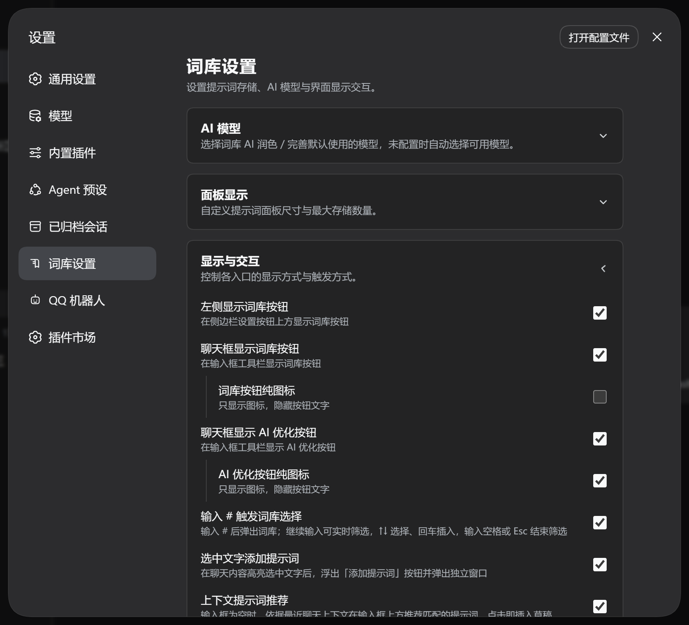
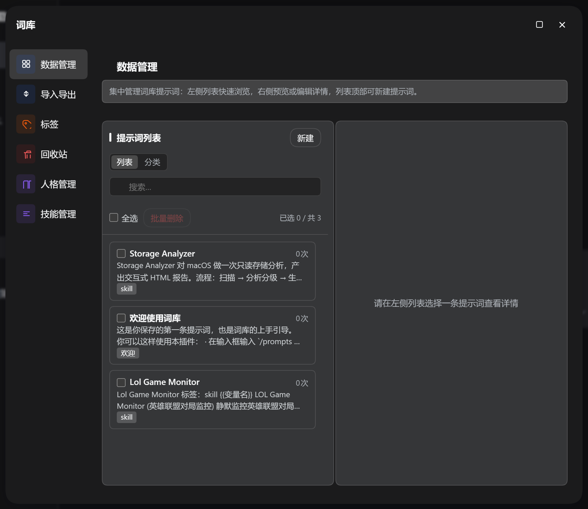
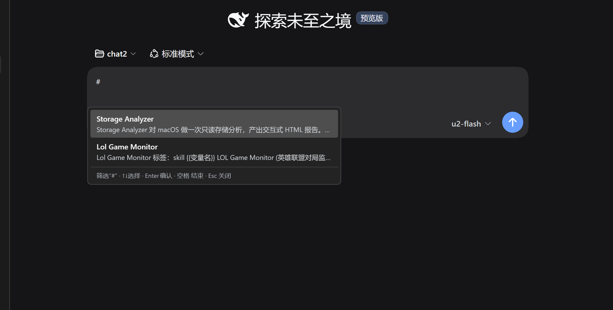

<div align="center">

[🇨🇳 中文](./README.md) | 🌐 **English**

</div>

# dsh-prompt-library

DSH (DeepSeek Harness) prompt library plugin: provides **prompt management**, **AI polish** and **persona customization** in the chat bar, helping you accumulate, reuse and continuously improve prompts.

## Key Features

### Prompt Library

- Manage frequently-used prompts (title + body + tags), with search, sorting, tag grouping and usage-count statistics
- Entry 1: the "Library" menu button above the settings button in the sidebar opens a centered panel whose navigation reaches Data Management, Import/Export, Tags, Recycle Bin, Personas, and Skills
- Entry 2: the prompt-library button beside the chat input opens recent/frequent prompts with one click
- **Insert**: appends to the existing content in the input box
- **Overwrite**: directly replaces the whole draft with this prompt
- **Insert & Send**: fills in template variables and sends with one click (uses the variable dialog when it contains `{{}}`); outside `#` scenarios it is only available when the draft is empty, avoiding accidentally carrying existing content; when triggered by `#`, the trigger word is filtered out while the preceding text is kept and sent along
- Type `#` to quickly trigger selection with real-time filtering
- The bottom shows the total number of tags and prompts in real time

### Generate Skills

- Select prompts in "Library menu → Skill Manager" (skill import dialog) to generate DSH Skills in batch
- AI generates an English skill name and description from the prompt content; the skill is written to `~/.dsh/skills/<name>/SKILL.md`, and can be triggered by typing `/skill-name` in the chat box, or auto-matched by the model from the description
- A link between the prompt and the skill is created automatically; regenerating the same prompt **overwrites the original skill directory** instead of adding endlessly
- If the body contains `{{variables}}`, the "placeholder auto-fill" capability is marked at generation time — when using the skill, AI infers and fills them automatically from the current semantic context, no manual input needed

### AI Polish

- The "AI Polish" button in the chat bar optimizes text with one click, then replaces it back into the input box with one click
- The polishing process follows the constraints of the persona settings

### Persona (AI read-only reference)

Persona bodies live in the database (`prompts.db`: default persona in the meta table, custom ones in the personas table), constraining every AI call and the session they apply to, forming a stable assistant persona. A complete default template is seeded automatically when missing; its content is **manually maintained by the user**, and AI only reads it without modifying it on its own. Multiple personas (SOUL) can be created and bound per workspace/project — new sessions opened under a matched path automatically adopt that persona.


| Storage | Meaning | Purpose                                   |
| ------- | ------- | ----------------------------------------- |
| SOUL    | Persona | Identity, tone/personality, working rules |

- When the input is empty, matching prompts are recommended above the input based on recent chat context; click to insert into the draft
- The persona is the user's explicit configuration (including the default template), and AI follows its personality, tone and working rules accordingly

### Settings

Under DSH Settings → Prompt Library, adjust: AI model selection, panel size, library-menu button visibility, chat-bar button visibility/icon-only, `#` triggering, context recommendations, add-prompt-from-selection, maximum stored prompts, etc. Changes take effect immediately.

## Data Storage

The library uses **SQLite** (`node:sqlite`); all other configs and logs are stored under `~/.dsh/prompt-library/`:

```
~/.dsh/prompt-library/
├── db/prompts.db      # prompt library, personas & bindings (SQLite)
├── log/
│   └── ai-YYYY-MM-DD.log   # AI diagnostic logs (per-day files)
└── character/         # (legacy, migration read-only; personas now live in the database)
~/.dsh/settings.yaml   # plugin settings (prompt-library namespace)
```

## Installation

```bash
dsh plugin --profile web add @sunjuntao/dsh-prompt-library
```

## Usage

Start `dsh web`, click the "Library" menu button above the settings button in the sidebar to reach every feature panel; or use the prompt-library button beside the chat input, type `#` for the quick picker, and click "AI Polish" to polish your input with one click.

## Development / Build

```bash
npm install
npm run deploy   # type check + build + sync to DSH (restart dsh web to take effect)
```

## Screenshots



## Author

**master1Sun**

- GitHub: [https://github.com/master1Sun/dsh-prompt-library](https://github.com/master1Sun/dsh-prompt-library)
