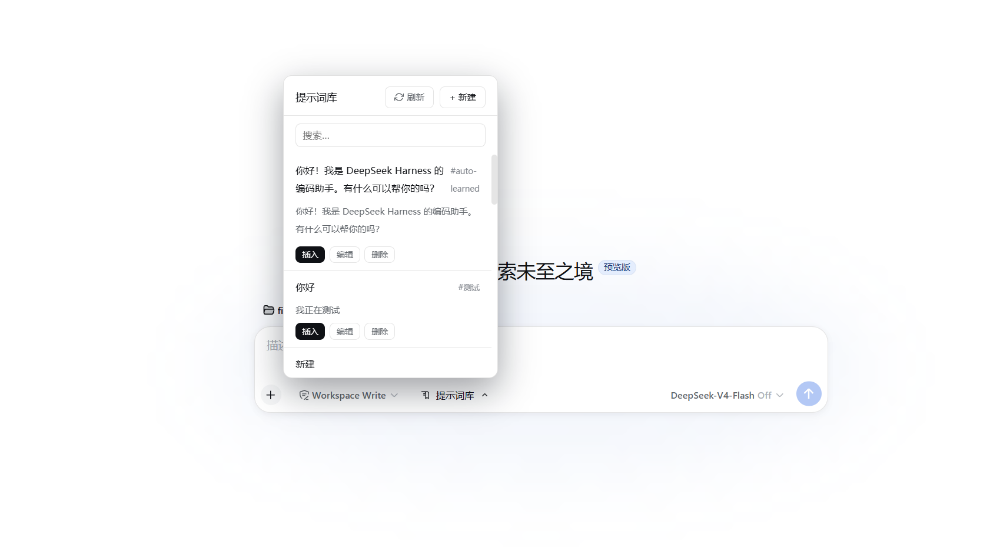
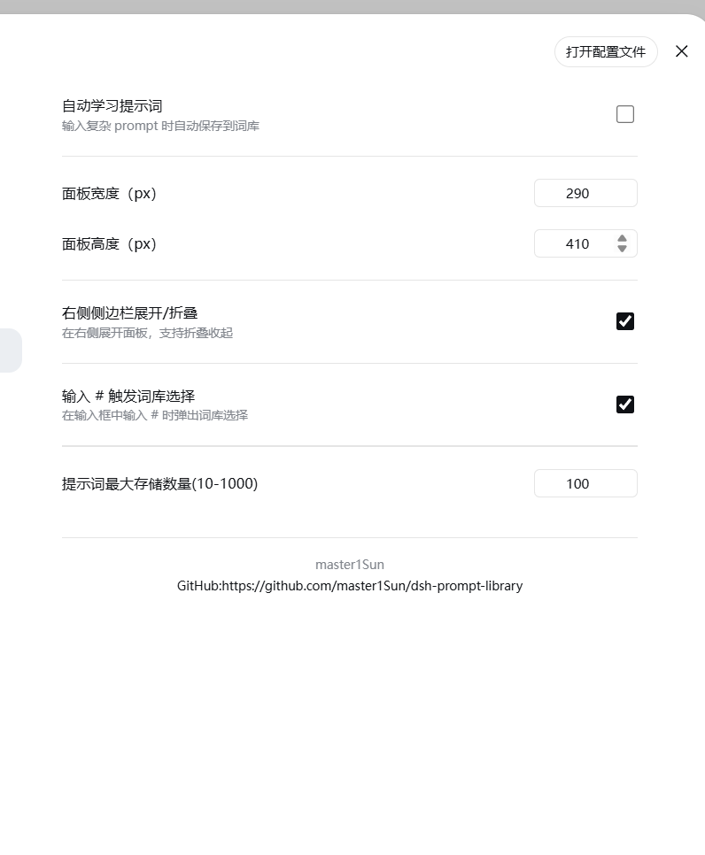
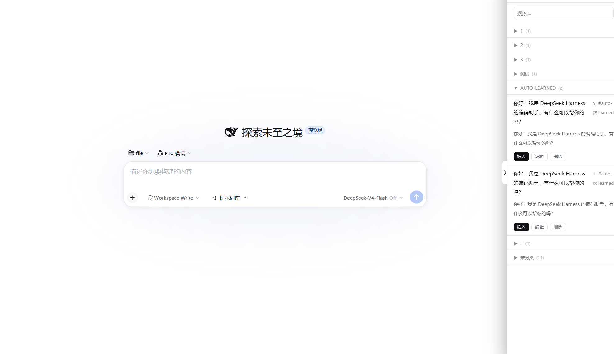

# dsh-prompt-library

DSH（DeepSeek Harness）Web 插件：在 composer 工具栏注入一个「提示词库」按钮，管理可复用的 prompt 片段，点击即可插入当前输入框。

支持**自动学习**、**原生设置面板**、**右侧侧边栏模式**和 **# 键快速触发**。

## 功能

### 提示词管理

- **创建**：新增提示词（标题 + 正文 + 标签）
- **编辑/删除**：修改或删除已有提示词
- **搜索**：按关键词搜索提示词（匹配标题、正文和标签）
- **一键插入**：点击列表中的提示词，自动插入到当前输入框
- **排序规则**：使用最多的前 3 条置顶，其余按更新时间倒序排列
- **新增高亮**：新建 / 自动学习的提示词带「新增」标记高亮显示
- **标签分组**：按标签分组展示，多标签的提示词会出现在每个对应分组中

### 自动学习（AI 自学习）

输入适合作为提示词的文本后，停止输入约 3 秒，插件会自动识别并保存到词库。

- 自动去重（精确正文匹配）
- 自动生成标题（取首行前 40 字符）
- 标记 `auto-learned` 标签（标签名可在设置中自定义）
- 可通过设置面板**关闭**此功能，或调整最小学习长度

### 设置面板

注册到 DSH 原生设置界面（设置 → 提示词库），修改后立即生效，无需保存。支持：

- **自动学习开关**：开启/关闭自动学习功能
- **自动学习标签**：自定义自动学习使用的标签名
- **最小学习长度**：自动学习的最小字符数（20–500，默认 60）
- **面板宽度**：自定义面板宽度（280–800px，默认 380px）
- **面板高度**：自定义面板高度（300–800px，默认 500px）
- **右侧侧边栏展开/折叠**：切换面板为右侧侧边栏模式，支持折叠收起
- **输入 # 触发词库选择**：在输入框中输入 `#` 时弹出词库选择
- **鼠标移入显示详情**：开启后，鼠标移入提示词行时显示完整详情（标题、标签、正文）
- **提示词最大存储数量**：限制词库保存数量（10–1000，默认 100）

设置导航中的「提示词库」图标与聊天栏按钮图标保持一致。

### 右侧侧边栏模式

开启后，面板固定在屏幕右侧，类似侧边栏：

- 点击面板左侧边缘的折叠按钮可收起
- 折叠后屏幕右侧边缘显示展开标签，点击即可恢复
- 侧边栏模式下面板提供「插入」按钮，将提示词插入聊天输入框
- 支持平滑动画过渡

### # 键触发词库选择

开启后，在输入框中输入 `#` 字符，会自动弹出提示词选择浮层：

- 按 `↑` `↓` 键选择提示词
- 按 `Enter` 键插入选中的提示词
- 按 `Esc` 键关闭浮层
- 鼠标移入浮层行高亮，点击可直接插入
- 浮层中标题与正文预览区分显示
- 智能定位：输入框靠近底部时自动翻转到上方显示，避免遮挡

### 持久化

- 提示词数据保存在 `~/.dsh/prompt-library.json`
- 设置数据保存在 `~/.dsh/prompt-library-settings.json`


## 效果图







## deepseek harness 插件安装方式

```
dsh plugin --profile web add @sunjuntao/dsh-prompt-library
```

## 安装

### 前置条件

- Node.js >= 22.19
- DSH 环境已配置

### 安装到 web profile

```bash
# 1. 进入 web profile 目录
cd ~/.dsh/profiles/web

# 2. 添加依赖
npm pkg set dependencies.dsh-prompt-library="latest"
# 或手动在 package.json 的 dependencies 中添加：
# "dsh-prompt-library": "latest"

# 3. 在 dsh.profile.bundles 中添加 "dsh-prompt-library"
# 编辑 package.json，在 dsh.profile.bundles 数组中追加

# 4. 安装
pnpm install --no-frozen-lockfile
```

### 从本地安装（开发模式）

```bash
cd ~/.dsh/profiles/web

# 在 package.json 中添加：
# "dependencies": { "dsh-prompt-library": "file:../../file/dsh-prompt-library" }
# 并在 dsh.profile.bundles 中追加 "dsh-prompt-library"

pnpm install --no-frozen-lockfile
```

## 构建

```bash
cd dsh-prompt-library
npm install
npm run build
```

构建产物：

- `lib/index.js` — host 入口（Node ESM）
- `lib/client.js` — 浏览器入口（`__ModuleLoader__` 格式）

## 使用

启动 DSH Web：

```bash
dsh web
```

在对话输入框左侧工具栏会看到一个 **提示词库** 按钮，点击打开提示词库面板。

### 基本操作

- **+ 新建**：新建提示词（标题 + 正文 + 标签）
- **搜索框**：按关键词搜索已有提示词
- **插入**：将提示词正文插入到当前输入框
- **编辑** / **删除**：编辑或删除提示词
- **刷新**：刷新提示词列表（位于面板顶部，带旋转加载动画）

### 设置
在 DSH 原生设置界面中选择 **提示词库** 分组，可配置：
- 自动学习开关 / 标签 / 最小长度
- 面板宽度/高度
- 右侧侧边栏模式
- # 键触发词库选择
- 鼠标移入显示详情
- 提示词最大存储数量

### 自动学习

当你在输入框中输入以下类型的文本，停止输入约 3 秒后，插件会自动将其保存到提示词库：

- 长度 ≥ 设置的最小学习长度（默认 60 字符）
- 有多行结构或包含 `{var}` / `[var]` 占位符
- 有清晰的句子结构

保存时按钮上方会闪现绿色 **✓ 已自动学习** 提示，该提示词会被标记为自动学习标签（默认 `auto-learned`）。

### 右侧侧边栏

在设置中开启「右侧侧边栏展开/折叠」后，面板变为固定在屏幕右侧的侧边栏：

- 面板左侧边缘显示折叠按钮
- 折叠后右侧边缘显示展开标签
- 侧边栏模式下点击面板外部不会关闭面板

### # 键触发

在设置中开启「输入 # 触发词库选择」后，在输入框中输入 `#` 字符即可弹出词库选择浮层：

- 使用方向键选择，回车确认
- 浮层列表显示标题和正文预览
- 输入框在底部时浮层自动上翻显示

## 验证是否安装成功

```bash
dsh --profile web --dump-config | grep prompt-library
```

输出应包含：

```
# == dsh-prompt-library
- id: prompt-library
  name: dsh-prompt-library
```

## 技术栈

- **运行时**：DSH Cordis 插件框架
- **UI 插槽**：`conversation.input.left`、`settings.section`
- **前端**：React + TypeScript
- **构建**：esbuild
- **持久化**：JSON 文件

## 作者

**master1Sun**

- GitHub: [https://github.com/master1Sun/dsh-prompt-library](https://github.com/master1Sun/dsh-prompt-library)
