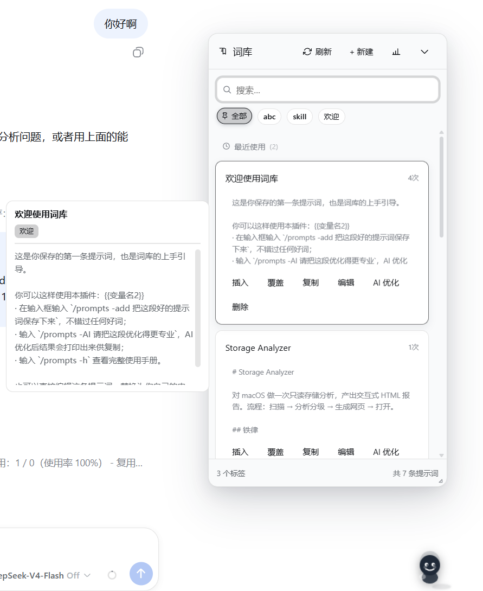
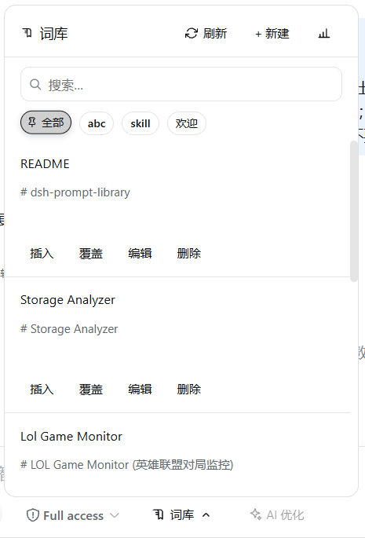
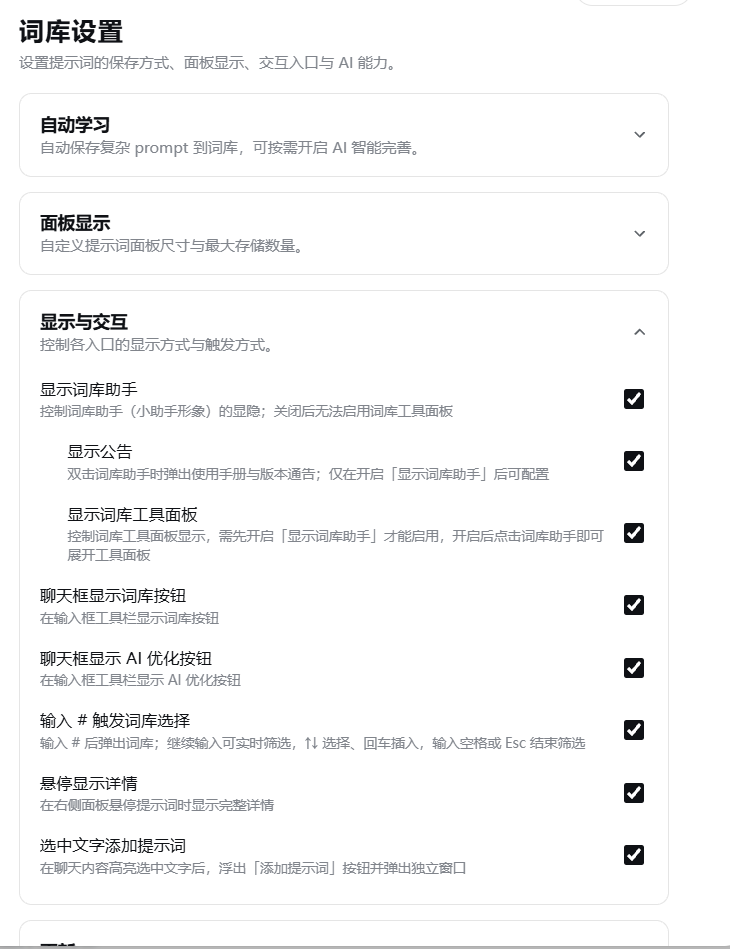
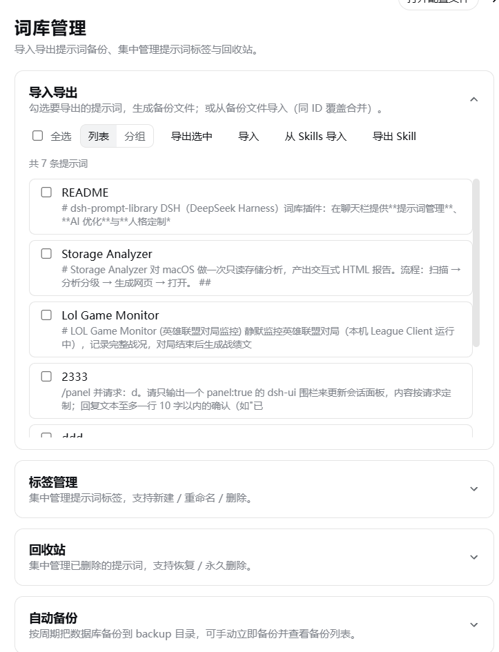

# dsh-prompt-library

DSH（DeepSeek Harness）词库插件：在聊天栏提供**提示词管理**、**AI 优化**与**人格定制**能力，帮你沉淀、复用和持续优化提示词。
DSH (DeepSeek Harness) prompt library plugin: provides **prompt management**, **AI polish** and **persona customization** in the chat bar, helping you accumulate, reuse and continuously improve prompts.

插件以对话框级提示词为核心内核，全部功能设计皆围绕此项能力构建，其余附属功能仅作锦上添花之用。热切期盼广大使用者分享想法与建议，将据此不断迭代优化。
The plugin treats conversation-level prompts as its core. Every feature is designed around this capability, while other auxiliary features are just a bonus. We warmly welcome users to share ideas and suggestions, and will keep iterating based on them.

## 主要功能 / Key Features

### 词库 / Prompt Library

- 管理常用提示词（标题 + 正文 + 标签），支持搜索、排序、标签分组、使用次数统计
- Manage frequently-used prompts (title + body + tags), with search, sorting, tag grouping and usage-count statistics
- 右侧面板与宿主左侧栏同款样式，自动挤占并收缩聊天区，展开/折叠自由切换
- The right panel shares the same style as the host's left sidebar, automatically squeezing and shrinking the chat area, freely toggling between expand/collapse
- **插入**：追加到输入框已有内容之后
- **Insert**: appends to the existing content in the input box
- **覆盖**：用该提示词直接替换整段草稿
- **Overwrite**: directly replaces the whole draft with this prompt
- **插入并发送**：填写模板变量后一键直接发出（含 `{{}}` 时走变量弹窗），非 `#` 场景下仅在草稿为空时可用，避免误带已有内容；`#` 触发时会过滤触发词、保留其前正文一并发送
- **Insert & Send**: fills in template variables and sends with one click (uses the variable dialog when it contains `{{}}`); outside `#` scenarios it is only available when the draft is empty, avoiding accidentally carrying existing content; when triggered by `#`, the trigger word is filtered out while the preceding text is kept and sent along
- 输入 `#` 快速触发选择，实时筛选
- Type `#` to quickly trigger selection with real-time filtering
- 底部实时显示标签总数与提示词总数
- The bottom shows the total number of tags and prompts in real time

### 生成 Skill / Generate Skills

- 在「词库管理 → 导入导出」勾选提示词后批量生成 DSH 技能（Skill）
- Select prompts under "Prompt Library → Import/Export" to generate DSH Skills in batch
- 由 AI 根据提示词内容生成英文技能名与描述，技能写盘到 `~/.dsh/skills/<name>/SKILL.md`，聊天框输入 `/技能名` 即可触发，模型也会按描述自动匹配
- AI generates an English skill name and description from the prompt content; the skill is written to `~/.dsh/skills/<name>/SKILL.md`, and can be triggered by typing `/skill-name` in the chat box, or auto-matched by the model from the description
- 生成时自动建立提示词与技能的关联；同一提示词再次生成会**覆盖原技能目录**，不会无限新增
- A link between the prompt and the skill is created automatically; regenerating the same prompt **overwrites the original skill directory** instead of adding endlessly
- 若正文含 `{{变量}}`，生成时会标注「占位符自动补全」能力——使用该技能时 AI 依据当前语义场景自动推断并补全，无需手动填值
- If the body contains `{{variables}}`, the "placeholder auto-fill" capability is marked at generation time — when using the skill, AI infers and fills them automatically from the current semantic context, no manual input needed

### AI 优化 / AI Polish

- 聊天栏「AI 优化」按钮一键优化文字，完成后一键替换回输入框
- The "AI Polish" button in the chat bar optimizes text with one click, then replaces it back into the input box with one click
- 优化过程遵循人格文件的约束
- The polishing process follows the constraints of the persona file

### 人格（AI 只读引用）/ Persona (AI read-only reference)

基于单个 `SOUL.md` 人格文件约束每一次 AI 调用与整个聊天会话，形成稳定的助手人格。文件默认生成模板、删除会自动重建；内容由**用户手动维护**，AI 只读引用、不擅自改写。
Each AI call and the whole chat session are constrained by a single `SOUL.md` persona file to form a stable assistant persona. The file is generated from a default template and rebuilt automatically if deleted; its content is **manually maintained by the user**, and AI only reads it without modifying it on its own.

| 文件      | 含义 | 作用                      |
| --------- | ---- | ------------------------- |
| `SOUL.md` | 人格 | 身份、性格/语气、工作规范 |
| File      | Meaning | Purpose |
| `SOUL.md` | Persona | Identity, tone/personality, working rules |

- 自动学习输入内容为提示词入库，AI 智能完善标题、标签、摘要和正文
- Automatically learn input content into the prompt library, with AI smart-refining titles, tags, summaries and bodies
- 人格文件为用户的显式设定（含默认模板），AI 据此遵循性格、语气与工作规范
- The persona file is the user's explicit configuration (including the default template), and AI follows its personality, tone and working rules accordingly

### 设置 / Settings

在 DSH 设置 → 词库调整：自动学习、手动确认、AI 智能完善、面板大小、侧边栏、按钮显隐、`#` 触发等，修改即时生效。
Under DSH Settings → Prompt Library, adjust: auto learning, manual confirmation, AI smart polish, panel size, sidebar, button visibility, `#` triggering, etc. Changes take effect immediately.

## 数据存储 / Data Storage

词库采用 **SQLite**（`node:sqlite`），其余配置与日志统一存放在 `~/.dsh/prompt-library/`：
The library uses **SQLite** (`node:sqlite`); all other configs and logs are stored under `~/.dsh/prompt-library/`:

```
~/.dsh/prompt-library/
├── db/prompts.db      # 词库（SQLite）/ prompt library (SQLite)
├── log/
│   └── ai-YYYY-MM-DD.log   # AI 调用诊断日志（按日期分文件）/ AI diagnostic logs (per-day files)
└── character/         # 人格文件 / persona file
    └── SOUL.md
```

## 安装 / Installation

```bash
dsh plugin --profile web add @sunjuntao/dsh-prompt-library
```

## 使用 / Usage

启动 `dsh web`，点击聊天栏「词库」按钮打开面板，或输入 `#` 快速触发；点击「AI 优化」一键优化输入内容。
Start `dsh web`, click the "Prompt Library" button in the chat bar to open the panel, or type `#` to trigger it quickly; click "AI Polish" to polish your input with one click.

## 开发 / 构建 / Development / Build

```bash
npm install
npm run deploy   # 类型检查 + 构建 + 同步到 DSH（需重启 dsh web 生效）/ type check + build + sync to DSH (restart dsh web to take effect)
```

## 效果图 / Screenshots



## 作者 / Author

**master1Sun**

- GitHub: [https://github.com/master1Sun/dsh-prompt-library](https://github.com/master1Sun/dsh-prompt-library)
